# 🎨 ServiMap Design System & UI/UX Strategy
## Análisis Exhaustivo y Plan de Implementación

---

## 📊 1. ANÁLISIS DEL ESTADO ACTUAL

### 1.1 Fortalezas Identificadas
- ✅ **Stack tecnológico sólido**: React + Firebase + shadcn/ui
- ✅ **Funcionalidades completas**: 200+ features implementadas
- ✅ **Componentes modulares**: 80+ componentes React existentes
- ✅ **Sistema de colores base**: Azul primario #209ded ya definido
- ✅ **Estructura de páginas**: 10 páginas principales establecidas
- ✅ **PWA funcional**: Capacidades offline y notificaciones push

### 1.2 Gaps y Oportunidades de Mejora

#### 🔴 **Problemas Críticos**
1. **Inconsistencia visual**: Mezcla de JSX y TSX sin estándares claros
2. **Sin design tokens**: Variables CSS básicas sin sistema escalable
3. **Falta de jerarquía visual**: Homepage con estructura débil
4. **UX móvil limitada**: Componentes no optimizados para touch
5. **Sin sistema de espaciado**: Padding/margin inconsistentes
6. **Iconografía mixta**: Uso de emojis mezclados con Lucide icons
7. **Estados de componentes incompletos**: Falta loading, empty, error states
8. **Accesibilidad básica**: Sin implementación WCAG completa

#### 🟡 **Oportunidades de Mejora**
1. **Microinteracciones**: Agregar animaciones y feedback visual
2. **Dark mode**: Sistema de temas completo
3. **Personalización**: Preferencias de usuario adaptativas
4. **Onboarding guiado**: Tutorial interactivo para nuevos usuarios
5. **Dashboard analytics**: Visualizaciones de datos mejoradas
6. **Sistema de notificaciones**: Toast + push + in-app unificado

---

## 🎯 2. DESIGN SYSTEM COMPLETO - MATERIAL DESIGN 3

### 2.1 Fundamentos del Sistema

#### 📐 **Grid System & Layout**
```scss
// Breakpoints (Mobile-first)
$breakpoints: (
  'xs': 0,      // 0-599px
  'sm': 600px,  // 600-959px
  'md': 960px,  // 960-1279px
  'lg': 1280px, // 1280-1919px
  'xl': 1920px  // 1920px+
);

// Container maxWidths
$containers: (
  'sm': 540px,
  'md': 720px,
  'lg': 960px,
  'xl': 1140px,
  'xxl': 1320px
);

// Spacing Scale (8px base)
$spacing: (
  0: 0,
  1: 4px,
  2: 8px,
  3: 12px,
  4: 16px,
  5: 20px,
  6: 24px,
  8: 32px,
  10: 40px,
  12: 48px,
  16: 64px,
  20: 80px,
  24: 96px
);
```

#### 🎨 **Color System - Material You**
```typescript
// Primary Palette (Blue - #209ded base)
const colorSystem = {
  primary: {
    0: '#000000',
    10: '#001f2a',
    20: '#003544',
    30: '#004e63',
    40: '#006782',
    50: '#0082a3',
    60: '#209ded', // Main
    70: '#4db3f0',
    80: '#79c9f4',
    90: '#b9e3fa',
    95: '#dcf1fc',
    99: '#f6fbff',
    100: '#ffffff'
  },
  
  // Secondary Palette (Teal complement)
  secondary: {
    10: '#002022',
    20: '#003739',
    30: '#005052',
    40: '#00696c',
    50: '#008488',
    60: '#00a0a5',
    70: '#00bdc4',
    80: '#4fdbe2',
    90: '#8ef3f6',
    95: '#c7f9fb'
  },
  
  // Tertiary Palette (Orange accent)
  tertiary: {
    10: '#2d1600',
    20: '#492400',
    30: '#673300',
    40: '#864300',
    50: '#a75500',
    60: '#c96700',
    70: '#ec7b00',
    80: '#ff9933',
    90: '#ffcc99',
    95: '#ffe5cc'
  },
  
  // Semantic Colors
  success: {
    main: '#4caf50',
    light: '#81c784',
    dark: '#388e3c',
    contrast: '#ffffff'
  },
  
  warning: {
    main: '#ff9800',
    light: '#ffb74d',
    dark: '#f57c00',
    contrast: '#000000'
  },
  
  error: {
    main: '#f44336',
    light: '#ef5350',
    dark: '#c62828',
    contrast: '#ffffff'
  },
  
  // Surface Colors
  surface: {
    dim: '#d9d9dc',
    default: '#f9f9fc',
    bright: '#ffffff',
    container: {
      lowest: '#ffffff',
      low: '#f4f4f7',
      default: '#eeeff3',
      high: '#e8e8ed',
      highest: '#e2e2e7'
    }
  }
};
```

#### ✏️ **Typography System**
```typescript
const typography = {
  // Display
  displayLarge: {
    fontSize: '57px',
    lineHeight: '64px',
    fontWeight: 400,
    letterSpacing: '-0.25px'
  },
  displayMedium: {
    fontSize: '45px',
    lineHeight: '52px',
    fontWeight: 400,
    letterSpacing: '0px'
  },
  displaySmall: {
    fontSize: '36px',
    lineHeight: '44px',
    fontWeight: 400,
    letterSpacing: '0px'
  },
  
  // Headline
  headlineLarge: {
    fontSize: '32px',
    lineHeight: '40px',
    fontWeight: 400,
    letterSpacing: '0px'
  },
  headlineMedium: {
    fontSize: '28px',
    lineHeight: '36px',
    fontWeight: 400,
    letterSpacing: '0px'
  },
  headlineSmall: {
    fontSize: '24px',
    lineHeight: '32px',
    fontWeight: 400,
    letterSpacing: '0px'
  },
  
  // Title
  titleLarge: {
    fontSize: '22px',
    lineHeight: '28px',
    fontWeight: 500,
    letterSpacing: '0px'
  },
  titleMedium: {
    fontSize: '16px',
    lineHeight: '24px',
    fontWeight: 500,
    letterSpacing: '0.15px'
  },
  titleSmall: {
    fontSize: '14px',
    lineHeight: '20px',
    fontWeight: 500,
    letterSpacing: '0.1px'
  },
  
  // Body
  bodyLarge: {
    fontSize: '16px',
    lineHeight: '24px',
    fontWeight: 400,
    letterSpacing: '0.5px'
  },
  bodyMedium: {
    fontSize: '14px',
    lineHeight: '20px',
    fontWeight: 400,
    letterSpacing: '0.25px'
  },
  bodySmall: {
    fontSize: '12px',
    lineHeight: '16px',
    fontWeight: 400,
    letterSpacing: '0.4px'
  },
  
  // Label
  labelLarge: {
    fontSize: '14px',
    lineHeight: '20px',
    fontWeight: 500,
    letterSpacing: '0.1px'
  },
  labelMedium: {
    fontSize: '12px',
    lineHeight: '16px',
    fontWeight: 500,
    letterSpacing: '0.5px'
  },
  labelSmall: {
    fontSize: '11px',
    lineHeight: '16px',
    fontWeight: 500,
    letterSpacing: '0.5px'
  }
};

// Font Family
const fontFamily = {
  primary: '"Roboto", "Helvetica", "Arial", sans-serif',
  secondary: '"Montserrat", "Roboto", sans-serif',
  mono: '"Roboto Mono", "Courier New", monospace'
};
```

#### 🎭 **Elevation & Shadows (Material 3)**
```scss
$elevations: (
  0: none,
  1: (0px 1px 2px rgba(0, 0, 0, 0.3), 0px 1px 3px 1px rgba(0, 0, 0, 0.15)),
  2: (0px 1px 2px rgba(0, 0, 0, 0.3), 0px 2px 6px 2px rgba(0, 0, 0, 0.15)),
  3: (0px 4px 8px 3px rgba(0, 0, 0, 0.15), 0px 1px 3px rgba(0, 0, 0, 0.3)),
  4: (0px 6px 10px 4px rgba(0, 0, 0, 0.15), 0px 2px 3px rgba(0, 0, 0, 0.3)),
  5: (0px 8px 12px 6px rgba(0, 0, 0, 0.15), 0px 4px 4px rgba(0, 0, 0, 0.3))
);
```

#### 🎬 **Motion System**
```typescript
const motion = {
  // Duration tokens
  duration: {
    short1: '50ms',
    short2: '100ms',
    short3: '150ms',
    short4: '200ms',
    medium1: '250ms',
    medium2: '300ms',
    medium3: '350ms',
    medium4: '400ms',
    long1: '450ms',
    long2: '500ms',
    long3: '550ms',
    long4: '600ms',
    extraLong1: '700ms',
    extraLong2: '800ms',
    extraLong3: '900ms',
    extraLong4: '1000ms'
  },
  
  // Easing tokens
  easing: {
    emphasized: 'cubic-bezier(0.2, 0, 0, 1)',
    emphasizedDecelerate: 'cubic-bezier(0.05, 0.7, 0.1, 1)',
    emphasizedAccelerate: 'cubic-bezier(0.3, 0, 0.8, 0.15)',
    standard: 'cubic-bezier(0.2, 0, 0, 1)',
    standardDecelerate: 'cubic-bezier(0, 0, 0, 1)',
    standardAccelerate: 'cubic-bezier(0.3, 0, 1, 1)',
    legacy: 'cubic-bezier(0.4, 0, 0.2, 1)'
  }
};
```

---

## 🏗️ 3. COMPONENTES REUTILIZABLES

### 3.1 Sistema de Componentes Base

#### 📦 **Atomic Design Structure**
```
components/
├── atoms/           # Elementos básicos
│   ├── Button/
│   ├── Input/
│   ├── Badge/
│   ├── Icon/
│   ├── Typography/
│   └── Loader/
├── molecules/       # Combinaciones simples
│   ├── SearchBar/
│   ├── Card/
│   ├── Avatar/
│   ├── Rating/
│   ├── Chip/
│   └── Toast/
├── organisms/       # Componentes complejos
│   ├── Navigation/
│   ├── Header/
│   ├── ProviderCard/
│   ├── ServiceCard/
│   ├── ChatBubble/
│   └── MapView/
├── templates/       # Layouts de página
│   ├── DashboardLayout/
│   ├── AuthLayout/
│   ├── MapLayout/
│   └── ChatLayout/
└── pages/          # Páginas completas
```

### 3.2 Componentes Clave a Desarrollar

#### 🔘 **Button Component (Material 3)**
```tsx
// ServiButton.tsx
import { forwardRef } from 'react';
import { cn } from '@/lib/utils';
import { Ripple } from './Ripple';

interface ServiButtonProps {
  variant?: 'filled' | 'outlined' | 'text' | 'elevated' | 'tonal';
  size?: 'small' | 'medium' | 'large';
  color?: 'primary' | 'secondary' | 'tertiary' | 'error';
  startIcon?: React.ReactNode;
  endIcon?: React.ReactNode;
  fullWidth?: boolean;
  disabled?: boolean;
  loading?: boolean;
  ripple?: boolean;
  children: React.ReactNode;
  className?: string;
  onClick?: () => void;
}

export const ServiButton = forwardRef<HTMLButtonElement, ServiButtonProps>(
  ({ 
    variant = 'filled',
    size = 'medium',
    color = 'primary',
    startIcon,
    endIcon,
    fullWidth = false,
    disabled = false,
    loading = false,
    ripple = true,
    children,
    className,
    onClick,
    ...props 
  }, ref) => {
    const baseStyles = 'relative inline-flex items-center justify-center font-medium transition-all duration-200 rounded-full overflow-hidden';
    
    const variants = {
      filled: 'bg-primary text-white hover:shadow-md active:shadow-sm',
      outlined: 'border-2 border-primary text-primary hover:bg-primary/5',
      text: 'text-primary hover:bg-primary/5',
      elevated: 'bg-surface-container-low shadow-sm hover:shadow-md',
      tonal: 'bg-secondary-container text-on-secondary-container hover:shadow-sm'
    };
    
    const sizes = {
      small: 'h-8 px-3 text-sm gap-1.5',
      medium: 'h-10 px-6 text-base gap-2',
      large: 'h-12 px-8 text-lg gap-2.5'
    };
    
    return (
      <button
        ref={ref}
        className={cn(
          baseStyles,
          variants[variant],
          sizes[size],
          fullWidth && 'w-full',
          disabled && 'opacity-50 cursor-not-allowed',
          className
        )}
        disabled={disabled || loading}
        onClick={onClick}
        {...props}
      >
        {loading ? (
          <Loader className="animate-spin" />
        ) : (
          <>
            {startIcon && <span className="flex">{startIcon}</span>}
            {children}
            {endIcon && <span className="flex">{endIcon}</span>}
          </>
        )}
        {ripple && !disabled && <Ripple />}
      </button>
    );
  }
);
```

#### 🗂️ **Card Component (Material 3)**
```tsx
// ServiCard.tsx
interface ServiCardProps {
  variant?: 'elevated' | 'filled' | 'outlined';
  interactive?: boolean;
  className?: string;
  children: React.ReactNode;
}

export const ServiCard: React.FC<ServiCardProps> = ({
  variant = 'elevated',
  interactive = false,
  className,
  children
}) => {
  const variants = {
    elevated: 'bg-surface shadow-md',
    filled: 'bg-surface-variant',
    outlined: 'bg-surface border border-outline'
  };
  
  return (
    <div 
      className={cn(
        'rounded-xl p-4 transition-all duration-200',
        variants[variant],
        interactive && 'hover:shadow-lg cursor-pointer active:scale-[0.98]',
        className
      )}
    >
      {children}
    </div>
  );
};
```

#### 🔍 **SearchBar Component**
```tsx
// ServiSearchBar.tsx
interface ServiSearchBarProps {
  value: string;
  onChange: (value: string) => void;
  onSearch: () => void;
  placeholder?: string;
  suggestions?: string[];
  location?: boolean;
  voice?: boolean;
  className?: string;
}

export const ServiSearchBar: React.FC<ServiSearchBarProps> = ({
  value,
  onChange,
  onSearch,
  placeholder = "Buscar servicios...",
  suggestions = [],
  location = true,
  voice = true,
  className
}) => {
  const [focused, setFocused] = useState(false);
  const [showSuggestions, setShowSuggestions] = useState(false);
  
  return (
    <div className={cn("relative w-full", className)}>
      <div className={cn(
        "flex items-center gap-3 px-4 py-3 bg-surface-container-highest rounded-full transition-all duration-200",
        focused && "shadow-md ring-2 ring-primary/20"
      )}>
        <Search className="w-5 h-5 text-on-surface-variant" />
        
        <input
          type="text"
          value={value}
          onChange={(e) => onChange(e.target.value)}
          onFocus={() => setFocused(true)}
          onBlur={() => setFocused(false)}
          placeholder={placeholder}
          className="flex-1 bg-transparent outline-none text-on-surface placeholder:text-on-surface-variant"
        />
        
        <div className="flex items-center gap-2">
          {location && (
            <button className="p-2 hover:bg-primary/10 rounded-full transition-colors">
              <MapPin className="w-5 h-5 text-primary" />
            </button>
          )}
          
          {voice && (
            <button className="p-2 hover:bg-primary/10 rounded-full transition-colors">
              <Mic className="w-5 h-5 text-primary" />
            </button>
          )}
        </div>
      </div>
      
      {showSuggestions && suggestions.length > 0 && (
        <div className="absolute top-full left-0 right-0 mt-2 bg-surface rounded-2xl shadow-lg overflow-hidden z-50">
          {suggestions.map((suggestion, index) => (
            <button
              key={index}
              className="w-full px-4 py-3 text-left hover:bg-primary/5 transition-colors"
              onClick={() => {
                onChange(suggestion);
                setShowSuggestions(false);
              }}
            >
              <div className="flex items-center gap-3">
                <Clock className="w-4 h-4 text-on-surface-variant" />
                <span className="text-on-surface">{suggestion}</span>
              </div>
            </button>
          ))}
        </div>
      )}
    </div>
  );
};
```

---

## 📱 4. USER FLOWS PRINCIPALES

### 4.1 Flujo de Onboarding

```mermaid
graph LR
    A[Splash Screen] --> B{Primera vez?}
    B -->|Sí| C[Welcome Screens]
    B -->|No| H[Home]
    C --> D[Selección Rol]
    D --> E[Cliente/Prestador]
    E --> F[Registro/Login]
    F --> G[Permisos]
    G --> H[Home Personalizado]
```



**Pantallas del Onboarding:**
1. **Welcome Screen 1**: Beneficios de la app
2. **Welcome Screen 2**: Cómo funciona
3. **Welcome Screen 3**: Seguridad y confianza
4. **Role Selection**: Cliente o Prestador
5. **Auth Flow**: Registro simplificado
6. **Permissions**: Ubicación, notificaciones, cámara
7. **Profile Setup**: Información básica
8. **Tutorial**: Tour guiado interactivo

### 4.2 Flujo de Búsqueda y Contratación

```mermaid
graph TD
    A[Home] --> B[Search Bar]
    B --> C{Tipo búsqueda}
    C -->|Texto| D[Resultados Lista]
    C -->|Voz| E[Procesamiento IA]
    C -->|Categoría| F[Filtros]
    E --> D
    F --> D
    D --> G[Vista Mapa/Lista]
    G --> H[Detalle Prestador]
    H --> I{Acción}
    I -->|Chat| J[Conversación]
    I -->|Llamada| K[Video/Audio]
    I -->|Contratar| L[Checkout]
    J --> L
    K --> L
    L --> M[Confirmación]
    M --> N[Tracking]
```



### 4.3 Flujo de Chat y Cotización

```mermaid
graph LR
    A[Iniciar Chat] --> B[Mensaje Inicial]
    B --> C{Tipo Respuesta}
    C -->|Texto| D[Conversación]
    C -->|Media| E[Fotos/Videos]
    C -->|Cotización| F[Crear Cotización]
    D --> G[Negociación]
    E --> G
    F --> G
    G --> H{Decisión}
    H -->|Aceptar| I[Pago]
    H -->|Rechazar| J[Fin]
    H -->|Modificar| F
    I --> K[Servicio Activo]
```



---

## 🎨 5. REDISEÑO DE PÁGINAS PRINCIPALES

### 5.1 Landing Page (Marketing)

#### Layout Structure
```tsx
<LandingPage>
  {/* Hero Section - Full viewport */}
  <HeroSection>
    <AnimatedBackground /> {/* Gradient animado o video */}
    <Headline />
    <Subheadline />
    <SearchBar prominent />
    <TrustIndicators /> {/* "10k+ prestadores", "Verificados", etc */}
  </HeroSection>
  
  {/* Categorías Populares */}
  <CategoriesSection>
    <SectionTitle />
    <CategoryGrid animated /> {/* 6-8 categorías con iconos */}
  </CategoriesSection>
  
  {/* Cómo Funciona */}
  <HowItWorksSection>
    <StepCard number="1" title="Busca" description="..." />
    <StepCard number="2" title="Contacta" description="..." />
    <StepCard number="3" title="Contrata" description="..." />
  </HowItWorksSection>
  
  {/* Prestadores Destacados */}
  <FeaturedProviders>
    <ProviderCarousel /> {/* Swipeable cards */}
  </FeaturedProviders>
  
  {/* Testimonios */}
  <TestimonialsSection>
    <TestimonialCard />
  </TestimonialsSection>
  
  {/* CTA Section */}
  <CTASection>
    <DownloadApp /> {/* Links a stores */}
    <BecomeProvider /> {/* CTA para prestadores */}
  </CTASection>
  
  {/* Footer */}
  <Footer />
</LandingPage>
```

### 5.2 Dashboard Cliente

#### Layout Structure
```tsx
<ClientDashboard>
  {/* Header Personalizado */}
  <DashboardHeader>
    <Greeting /> {/* "Hola, Juan" con hora del día */}
    <NotificationBell />
    <ProfileAvatar />
  </DashboardHeader>
  
  {/* Quick Actions */}
  <QuickActions>
    <ActionCard icon="search" label="Buscar Servicio" />
    <ActionCard icon="emergency" label="Emergencia" urgent />
    <ActionCard icon="schedule" label="Programar" />
    <ActionCard icon="favorites" label="Favoritos" />
  </QuickActions>
  
  {/* Servicios Activos */}
  <ActiveServices>
    <ServiceCard status="in-progress" provider={...} />
    <ServiceCard status="scheduled" provider={...} />
  </ActiveServices>
  
  {/* Recomendaciones */}
  <Recommendations>
    <RecommendationCard based-on="history" />
    <RecommendationCard based-on="location" />
  </Recommendations>
  
  {/* Historial Reciente */}
  <RecentHistory>
    <HistoryItem />
  </RecentHistory>
  
  {/* Bottom Navigation */}
  <BottomNav />
</ClientDashboard>
```

### 5.3 Dashboard Prestador

#### Layout Structure
```tsx
<ProviderDashboard>
  {/* Status Bar */}
  <StatusBar>
    <AvailabilityToggle />
    <EarningsToday />
    <Rating />
  </StatusBar>
  
  {/* Métricas Principales */}
  <MetricsCards>
    <MetricCard title="Servicios Hoy" value="5" trend="+2" />
    <MetricCard title="Ingresos Mes" value="$12,500" trend="+15%" />
    <MetricCard title="Rating" value="4.8" trend="=" />
    <MetricCard title="Completados" value="156" trend="+12" />
  </MetricsCards>
  
  {/* Solicitudes Pendientes */}
  <PendingRequests>
    <RequestCard urgent />
    <RequestCard />
  </PendingRequests>
  
  {/* Calendario */}
  <ScheduleCalendar>
    <DayView />
    <WeekView />
  </ScheduleCalendar>
  
  {/* Chat Activos */}
  <ActiveChats>
    <ChatPreview unread={3} />
  </ActiveChats>
  
  {/* Performance */}
  <PerformanceChart />
</ProviderDashboard>
```

### 5.4 Sistema de Búsqueda y Mapas

#### Layout Structure
```tsx
<SearchMapView>
  {/* Search Header */}
  <SearchHeader>
    <BackButton />
    <SearchBar expanded />
    <FilterButton />
  </SearchHeader>
  
  {/* Filters Bar */}
  <FiltersBar>
    <FilterChip label="Disponible ahora" />
    <FilterChip label="Mejor valorados" />
    <FilterChip label="Precio" />
    <FilterChip label="Distancia" />
  </FiltersBar>
  
  {/* Split View */}
  <SplitContainer>
    {/* Mapa 60% */}
    <MapView>
      <GoogleMap />
      <MapControls />
      <LocationButton />
    </MapView>
    
    {/* Lista 40% */}
    <ResultsList>
      <ResultCard />
      <ResultCard />
    </ResultsList>
  </SplitContainer>
  
  {/* Mobile: Toggle Map/List */}
  <MobileToggle />
</SearchMapView>
```

---

## 📐 6. ESTRUCTURA PWA Y APPS NATIVAS

### 6.1 Arquitectura PWA

```typescript
// PWA Configuration
const pwaConfig = {
  manifest: {
    name: 'ServiMap',
    short_name: 'ServiMap',
    description: 'Servicios profesionales cerca de ti',
    theme_color: '#209ded',
    background_color: '#ffffff',
    display: 'standalone',
    orientation: 'portrait',
    start_url: '/',
    icons: [
      { src: '/icon-192.png', sizes: '192x192', type: 'image/png' },
      { src: '/icon-512.png', sizes: '512x512', type: 'image/png' },
      { src: '/icon-maskable.png', sizes: '512x512', type: 'image/png', purpose: 'maskable' }
    ]
  },
  
  workbox: {
    runtimeCaching: [
      {
        urlPattern: /^https:\/\/api\.servimap\.com\/.*$/,
        handler: 'NetworkFirst',
        options: {
          cacheName: 'api-cache',
          networkTimeoutSeconds: 10,
          expiration: {
            maxEntries: 50,
            maxAgeSeconds: 300 // 5 minutos
          }
        }
      },
      {
        urlPattern: /\.(?:png|jpg|jpeg|svg|gif|webp)$/,
        handler: 'CacheFirst',
        options: {
          cacheName: 'image-cache',
          expiration: {
            maxEntries: 100,
            maxAgeSeconds: 30 * 24 * 60 * 60 // 30 días
          }
        }
      }
    ]
  }
};
```

### 6.2 Estructura Apps Nativas

```typescript
// React Native Structure
const nativeStructure = {
  screens: {
    // Stacks principales
    AuthStack: ['Welcome', 'Login', 'Register', 'Verification'],
    MainStack: ['Home', 'Search', 'Profile', 'Settings'],
    ServiceStack: ['ServiceDetail', 'Chat', 'Payment', 'Tracking'],
    
    // Tab Navigator
    TabNavigator: {
      Home: { icon: 'home', badge: null },
      Search: { icon: 'search', badge: null },
      Services: { icon: 'briefcase', badge: 'activeCount' },
      Messages: { icon: 'message', badge: 'unreadCount' },
      Profile: { icon: 'person', badge: null }
    }
  },
  
  components: {
    shared: ['Button', 'Card', 'Input', 'Modal', 'Toast'],
    native: ['CameraView', 'LocationPicker', 'PushHandler', 'BiometricAuth']
  }
};
```

---

## 🎯 7. GUÍAS DE ESTILO DETALLADAS

### 7.1 Guía de Colores

```scss
// Uso de colores por contexto
.primary-actions {
  background: $primary-60;  // CTAs principales
  color: $primary-99;        // Texto sobre primary
}

.secondary-actions {
  background: $secondary-container;
  color: $on-secondary-container;
}

.surface-levels {
  .level-0 { background: $surface; }
  .level-1 { background: $surface-container-lowest; }
  .level-2 { background: $surface-container-low; }
  .level-3 { background: $surface-container; }
  .level-4 { background: $surface-container-high; }
  .level-5 { background: $surface-container-highest; }
}

.semantic-colors {
  .success { color: $success-main; }
  .warning { color: $warning-main; }
  .error { color: $error-main; }
  .info { color: $primary-60; }
}
```

### 7.2 Guía de Tipografía

```scss
// Jerarquía tipográfica
.page-title { @include display-large; }
.section-title { @include headline-medium; }
.card-title { @include title-large; }
.body-text { @include body-medium; }
.caption { @include label-small; }

// Responsive typography
@media (max-width: $breakpoint-sm) {
  .page-title { @include display-medium; }
  .section-title { @include headline-small; }
}
```

### 7.3 Guía de Espaciado

```scss
// Spacing system
.container { padding: $spacing-4; }
.section { margin-bottom: $spacing-8; }
.card { padding: $spacing-3; }
.button-group { gap: $spacing-2; }

// Responsive spacing
@media (min-width: $breakpoint-md) {
  .container { padding: $spacing-6; }
  .section { margin-bottom: $spacing-12; }
}
```

### 7.4 Guía de Componentes

```typescript
// Component Guidelines
const componentGuidelines = {
  buttons: {
    primary: 'Para acciones principales (1 por pantalla)',
    secondary: 'Para acciones secundarias',
    text: 'Para acciones terciarias o navegación',
    fab: 'Para acción principal flotante (crear, agregar)'
  },
  
  cards: {
    elevated: 'Para contenido que necesita jerarquía',
    filled: 'Para contenido agrupado',
    outlined: 'Para contenido seleccionable'
  },
  
  inputs: {
    filled: 'Para formularios densos',
    outlined: 'Para formularios con poco contenido'
  },
  
  feedback: {
    snackbar: 'Para confirmaciones breves',
    dialog: 'Para decisiones importantes',
    bottomSheet: 'Para opciones contextuales',
    toast: 'Para notificaciones no bloqueantes'
  }
};
```

---

## 📋 8. PLAN DE IMPLEMENTACIÓN PASO A PASO

### Fase 1: Fundación (Semana 1-2)
1. **Design Tokens**
   - [ ] Implementar sistema de colores Material You
   - [ ] Configurar tipografía responsive
   - [ ] Establecer sistema de espaciado
   - [ ] Crear tokens de elevación y sombras

2. **Componentes Base**
   - [ ] Migrar Button a Material 3
   - [ ] Actualizar Card system
   - [ ] Implementar nuevo Input
   - [ ] Crear sistema de Feedback

3. **Configuración**
   - [ ] Setup Tailwind con design tokens
   - [ ] Configurar Storybook
   - [ ] Implementar tema dark mode
   - [ ] Setup testing para componentes

### Fase 2: Componentes Core (Semana 3-4)
1. **Navigation Components**
   - [ ] Bottom Navigation Material 3
   - [ ] Navigation Rail (tablet)
   - [ ] Navigation Drawer
   - [ ] Top App Bar variants

2. **Data Display**
   - [ ] Provider Card redesign
   - [ ] Service Card update
   - [ ] List items Material 3
   - [ ] Data tables

3. **Feedback & Overlays**
   - [ ] Dialog system
   - [ ] Bottom sheets
   - [ ] Snackbars
   - [ ] Progress indicators

### Fase 3: Páginas Principales (Semana 5-6)
1. **Landing & Onboarding**
   - [ ] Nueva landing page
   - [ ] Onboarding flow
   - [ ] Role selection
   - [ ] Tutorial interactivo

2. **Dashboards**
   - [ ] Cliente dashboard
   - [ ] Prestador dashboard
   - [ ] Admin dashboard
   - [ ] Analytics views

3. **Core Features**
   - [ ] Search & filters
   - [ ] Map integration
   - [ ] Chat interface
   - [ ] Payment flow

### Fase 4: Features Avanzados (Semana 7-8)
1. **Interacciones**
   - [ ] Microanimaciones
   - [ ] Gestos touch
   - [ ] Drag & drop
   - [ ] Haptic feedback

2. **Personalización**
   - [ ] Temas dinámicos
   - [ ] Preferencias usuario
   - [ ] Accesibilidad completa
   - [ ] Multi-idioma

3. **Optimización**
   - [ ] Code splitting
   - [ ] Lazy loading
   - [ ] Image optimization
   - [ ] Performance monitoring

### Fase 5: Testing & Polish (Semana 9-10)
1. **Testing**
   - [ ] Unit tests componentes
   - [ ] Integration tests
   - [ ] E2E tests flows principales
   - [ ] Accessibility audit

2. **Refinamiento**
   - [ ] Pulir animaciones
   - [ ] Optimizar performance
   - [ ] Fix edge cases
   - [ ] Documentation

3. **Launch Prep**
   - [ ] Beta testing
   - [ ] User feedback
   - [ ] Final adjustments
   - [ ] Deployment

---

## 🚀 9. MÉTRICAS DE ÉXITO

### KPIs de UX
- **Task Success Rate**: >90% en tareas principales
- **Time on Task**: <2 min para contratar servicio
- **Error Rate**: <5% en formularios
- **SUS Score**: >80 (System Usability Scale)
- **NPS**: >50 (Net Promoter Score)

### KPIs de Performance
- **FCP**: <1.8s (First Contentful Paint)
- **LCP**: <2.5s (Largest Contentful Paint)
- **FID**: <100ms (First Input Delay)
- **CLS**: <0.1 (Cumulative Layout Shift)
- **TTI**: <3.8s (Time to Interactive)

### KPIs de Engagement
- **Daily Active Users**: +40% en 3 meses
- **Session Duration**: >5 minutos promedio
- **Retention Rate**: >60% a 30 días
- **Conversion Rate**: >15% visitor to user
- **Feature Adoption**: >70% usuarios usan chat

---

## 🎁 10. EXTRAS Y MEJORAS FUTURAS

### Innovaciones Propuestas
1. **AR Integration**
   - Vista AR para servicios en ubicación
   - Medición de espacios con cámara
   - Visualización de resultados

2. **AI Assistant**
   - Chatbot para soporte 24/7
   - Recomendaciones predictivas
   - Detección automática de necesidades

3. **Gamification**
   - Sistema de puntos y recompensas
   - Badges para prestadores
   - Challenges para usuarios

4. **Social Features**
   - Compartir prestadores favoritos
   - Reseñas sociales
   - Grupos de vecinos

5. **IoT Integration**
   - Conexión con smart home
   - Diagnóstico remoto
   - Mantenimiento predictivo

---

## 📚 RECURSOS Y REFERENCIAS

### Design Resources
- [Material Design 3 Guidelines](https://m3.material.io/)
- [Google Fonts - Roboto](https://fonts.google.com/specimen/Roboto)
- [Material Symbols](https://fonts.google.com/icons)
- [Material Theme Builder](https://material-foundation.github.io/material-theme-builder/)

### Development Tools
- [Tailwind CSS](https://tailwindcss.com/)
- [Radix UI](https://radix-ui.com/)
- [Framer Motion](https://framer.com/motion/)
- [React Hook Form](https://react-hook-form.com/)
- [Storybook](https://storybook.js.org/)

### Testing Tools
- [Jest](https://jestjs.io/)
- [React Testing Library](https://testing-library.com/react)
- [Cypress](https://cypress.io/)
- [Lighthouse](https://developers.google.com/web/tools/lighthouse)

---

## ✅ CHECKLIST DE IMPLEMENTACIÓN

### Inmediato (Sprint 1)
- [ ] Crear branch `feature/design-system`
- [ ] Setup Storybook
- [ ] Implementar tokens de diseño
- [ ] Crear componentes base (Button, Card, Input)
- [ ] Documentar guías de uso

### Corto Plazo (Sprint 2-3)
- [ ] Migrar componentes existentes
- [ ] Implementar dark mode
- [ ] Crear páginas principales
- [ ] Setup testing suite
- [ ] Optimizar performance

### Mediano Plazo (Sprint 4-6)
- [ ] Completar todas las páginas
- [ ] Implementar PWA completa
- [ ] Agregar animaciones
- [ ] A/B testing
- [ ] Launch beta

### Largo Plazo (Sprint 7+)
- [ ] Features avanzados (AR, AI)
- [ ] Expansión internacional
- [ ] Nuevas verticales
- [ ] App nativa mejorada
- [ ] Sistema de plugins

---

**Documento creado por:** ServiMap Design Team  
**Versión:** 1.0.0  
**Fecha:** 2025  
**Estado:** Ready for Implementation

---

Este Design System está listo para transformar ServiMap en una aplicación de clase mundial con una experiencia de usuario excepcional. 🚀